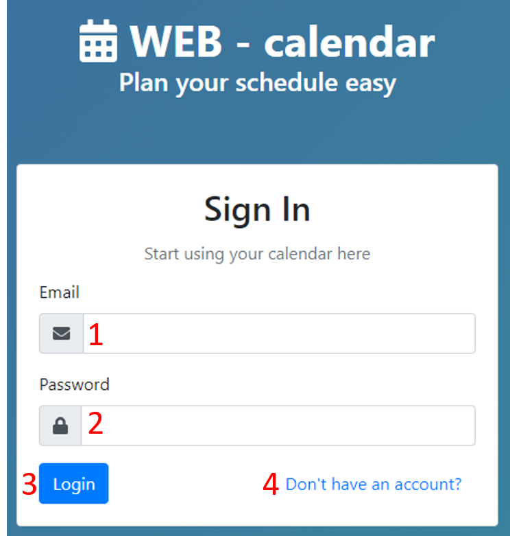
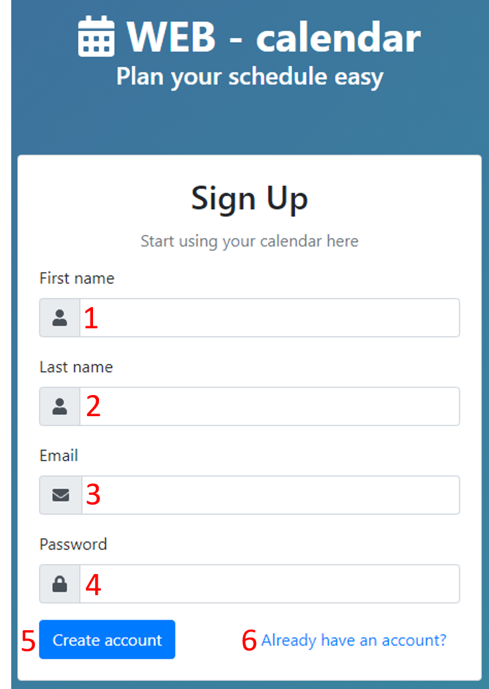
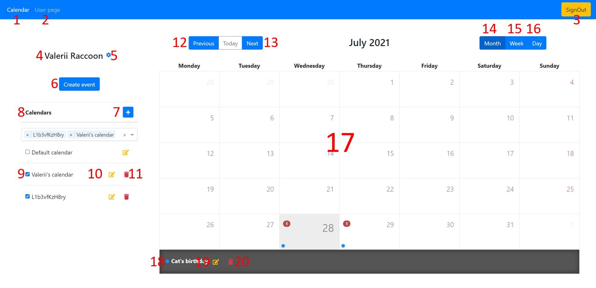
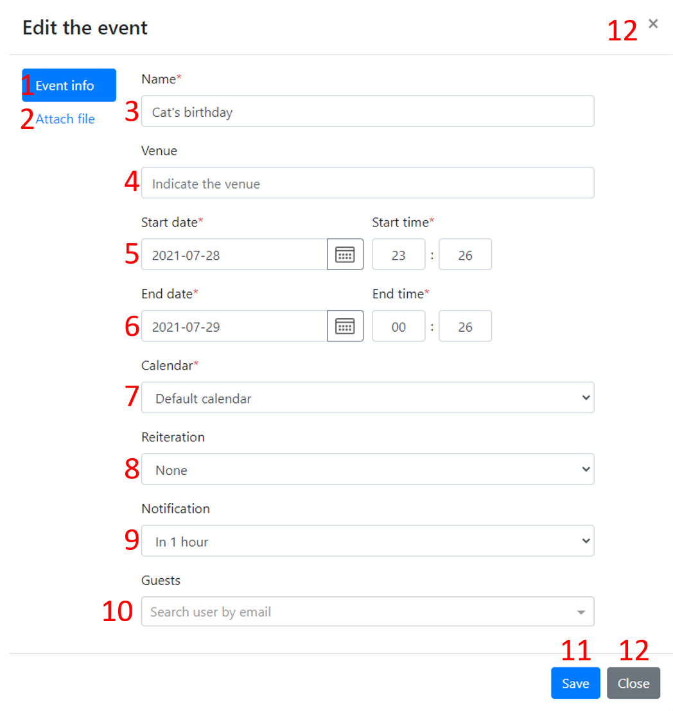
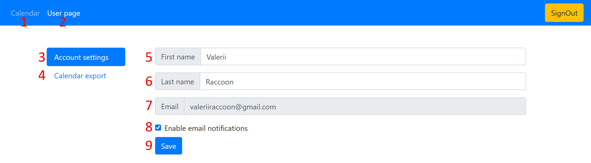
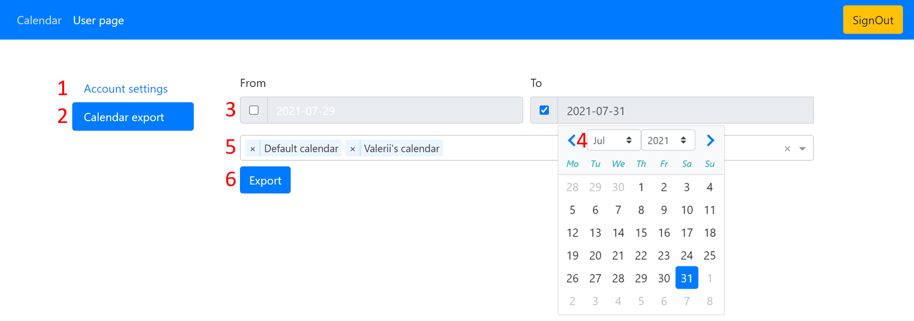
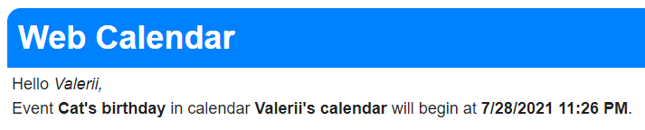

# web-calendar-spa

App for scheduling appointments, events and to do with the ability to create recurring events, set reminders and tasks, and invite others participants with email notification.

Check it now on [webcalendar.tk](https://webcalendar.tk)

This project was created by
[andrewpetrenko1](https://github.com/andrewpetrenko1), [RyzhkovaAnastasia](https://github.com/RyzhkovaAnastasia) and [valerachuk](https://github.com/valerachuk) under the guidance of [ilyaskav](https://github.com/ilyaskav) on [Apriorit](https://www.apriorit.com/)'s «Advanced .NET Web Development» course.

A large part of code was covered by unit tests.

## I was responsible for

- Creating project structure (server + client)
- Authentication
- Scheduled email notifications
- Exporting event and calendar
- Unit tests
- Deploying project

## Table of contents

- [About](#web-calendar-spa)
- [Technologies](#technologies)
- [Main features](#main-features)
- [User interface](#user-interface)
  - [Sign In form](#sign-in-form)
  - [Sign Up form](#sign-up-form)
  - [Calendar](#calendar)
  - [Create-edit event form](#create-edit-event-form)
  - [User page](#user-page)
    - [Account settings](#account-settings)
    - [Calendar export](#calendar-export)
- [Email notification example](#email-notification-example)

## Technologies

- Back-end
  - [ASP.NET Core](https://github.com/dotnet/aspnetcore)
  - [Entity Framework Core](https://github.com/dotnet/efcore)
  - [SQL Server](https://www.microsoft.com/en-us/sql-server)
  - [Hangfire](https://www.hangfire.io/)
  - [xUnit.net](https://xunit.net/)
  - [NLog](https://nlog-project.org/)
  - [AutoMapper](https://automapper.org/)
  - [iCal.NET](https://github.com/rianjs/ical.net)
- Front-end
  - [Angular](https://angular.io/)
  - [NG Bootstrap](https://ng-bootstrap.github.io/)
  - [angular-calendar](https://angular-calendar.com/)
  - [FileSaver.js](https://github.com/eligrey/FileSaver.js)

## Main features

- Calendars
  - You can crete multiple calendars. For example, personal and business
- Events
  - Events are attached to calendars
  - Events can be shared to other users
  - You can attach a file to an event
  - Events can be recurring i.e. repeat every day or week
- Export
  - You can export an event or a [calendar](#calendar-export) as ics file
- Email notifications
  - You will be notified when an event begins

## User interface

### Sign In form

1. Email field
2. Password field
3. Login button
4. [Sign Up](#sign-up-form) form link

### Sign Up form

1. First name field
2. Last name field
3. Email field
4. Password field
5. Register button
6. [Sign In](#sign-in-form) form link

### Calendar

1. [Calendar](#calendar) link - active
2. [User page](#user-page) link
3. `SignOut` button
4. First and last name. Can be changed in [Account settings](#account-settings)
5. [Account settings](#account-settings) link
6. `Create event` button. Opens [form](#create-edit-event-form) to schedule an event
7. :heavy_plus_sign: button. Opens form to create a calendar
8. List of calendars
9. :ballot_box_with_check:. Projects events of selected calendar to the grid (17)
10. `Edit calendar` button. Opens a calendar edit form
11. `Delete calendar` button. Deletes a calendar. Default calendar can't be deleted
12. `Previous` button. Navigates to the previous day/week/month
13. `Next` button. Navigates to the next day/week/month
14. `Month` button. Selects month view
15. `Week` button. Selects week view
16. `Day` button. Selects day view
17. Calendar grid
18. List of events in selected day. Event can be moved to another day, using drag & drop. Clicking on an event opens info about it. Here the event can be exported
19. `Edit event` button. Opens an [event edit form](#create-edit-event-form)
20. `Delete event` button. Deletes an event

### Create-edit event form

1. Event info section - active
2. Attach file section. Allows you to attach a file to the event
3. Name field
4. Venue field
5. Date and time when the event begins
6. Date and time when the event ends
7. Calendar select. Calendar where the event will be located
8. Reiteration select. Possible options: **None**, **Every day**, **Every week**
9. Notification select. Possible options: **None**, **In 10 minutes**, **In 15 minutes**, **In 30 minutes**, **In 1 hour**
10. List of guests that will be invited to this event. Event will be added to their default calendar
11. `Save` button. Saves the event
12. `Close` button. Closes the form

### User page

User page has two sections: **Account settings** and **Calendar export**

#### Account settings

Allows you to change first and last name, enable / disable email notifications.

1. [Calendar](#calendar) link
2. [User page](#user-page) link - active
3. [Account settings](#account-settings) section - active
4. [Calendar export](#calendar-export) section
5. First name field
6. Last name field
7. Email field. It can't be changed
8. Email notifications :ballot_box_with_check:. Enables/disabled email notifications
9. `Save` button. Applies changes

#### Calendar export

Allows you to export calendars in ics format. You can specify date period to export.

1. [Account settings](#account-settings) section
2. [Calendar export](#calendar-export) section - active
3. **From** and **To** field. Allows you to specify date range of calendars
4. When :ballot_box_with_check: is checked you can specify date by clicking field
5. Calendar list to export. You can specify calendars to export
6. `Export` button. Starts downloading

## Email notification example

